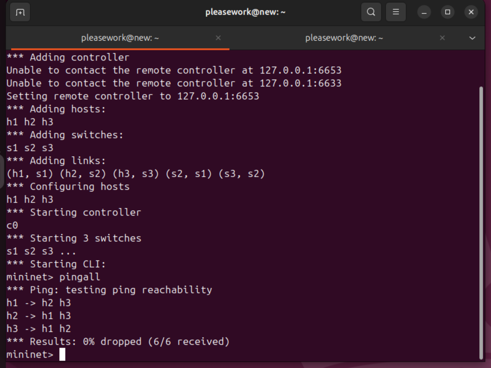
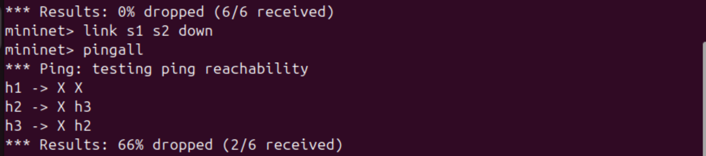
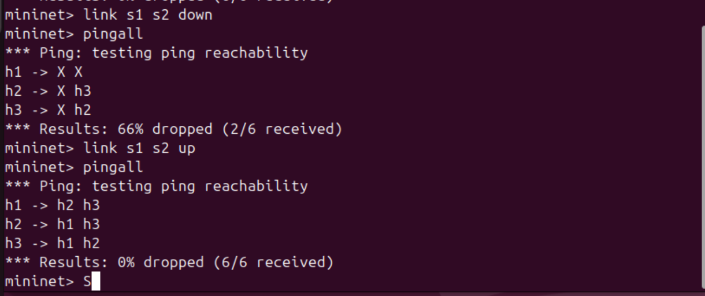
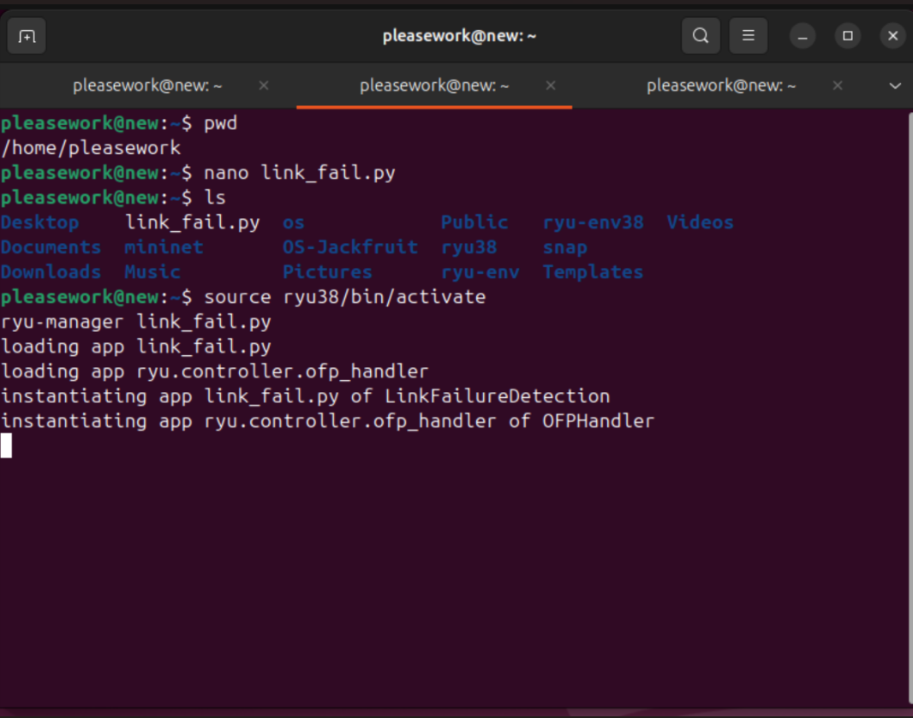
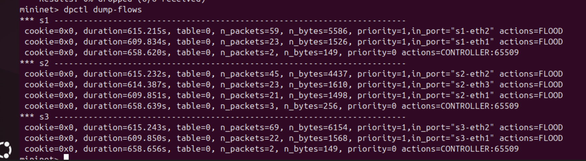

# SDN Link Failure Detection using Mininet and Ryu

## Problem Statement

This project demonstrates link failure detection and recovery in a Software Defined Network (SDN) using Mininet and the Ryu controller.

## Tools Used

* Mininet
* Ryu Controller
* Python

## Topology

Linear topology with 3 switches and 3 hosts:
h1 - s1 - s2 - s3 - h3

## Steps to Run

1. Activate environment:
   source ryu38/bin/activate

2. Run controller:
   ryu-manager link_fail.py

3. Start Mininet:
   sudo mn --topo linear,3 --controller remote

4. Test:
   pingall
   link s1 s2 down
   pingall
   link s1 s2 up
   pingall

## Expected Output

* Initially: 0% packet loss
* After link failure: packet loss observed
* After recovery: 0% packet loss

## Observations

* Controller installs flow rules dynamically
* Link failure disrupts communication
* Network recovers after link restoration

## Proof of Execution

### 1. Initial Connectivity

### 2. Link Down

### 3. Failure & Recovery

### 4. Controller Running

### 5. Flow Table

## Conclusion

This project successfully demonstrates SDN-based link failure detection and recovery using dynamic flow rule installation.
